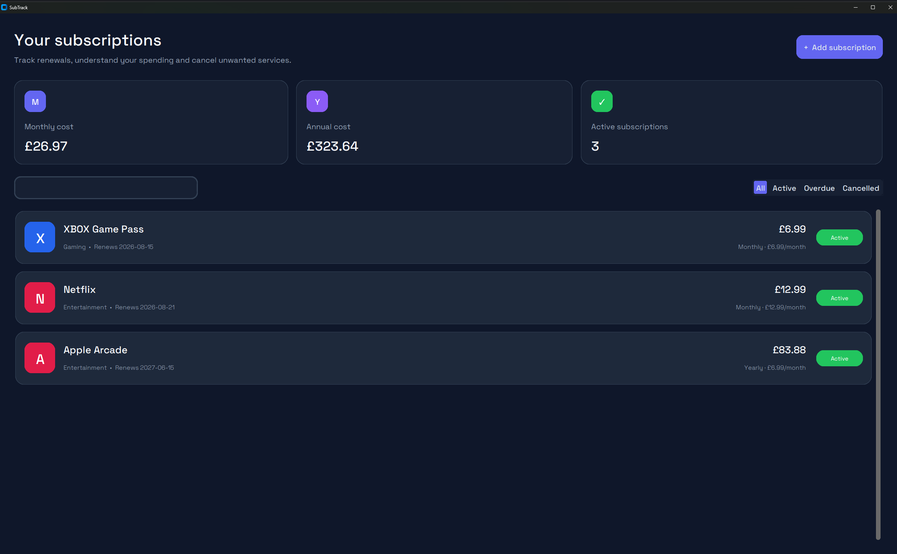

# SubTrack

SubTrack is a Windows desktop application for tracking recurring
subscriptions, renewal dates and estimated spending.

This is the first working version of the application.



## Features

- Add, edit and delete subscriptions
- Track monthly and annual subscription costs
- Search subscriptions by name or category
- Filter active, overdue and cancelled subscriptions
- Store cancellation links and instructions
- Mark subscriptions as cancelled
- Save subscription data locally using SQLite
- Custom dark interface using CustomTkinter
- Bundled Space Grotesk font
- Distributable Windows version

## Technologies

- Python
- CustomTkinter
- Tkinter
- SQLite
- PyInstaller

## Project structure

```text
SubTrack/
├── main.py
├── database.py
├── calculations.py
├── requirements.txt
├── fonts/
└── screenshots/